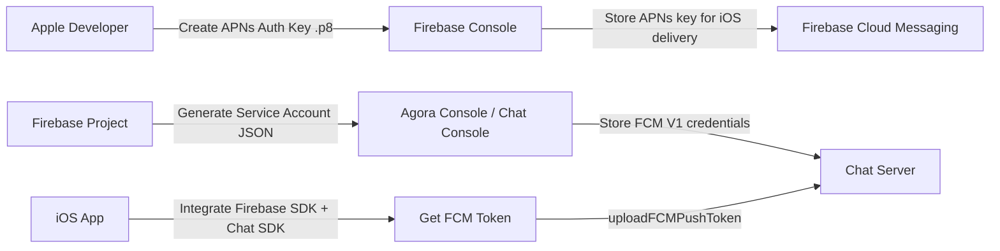
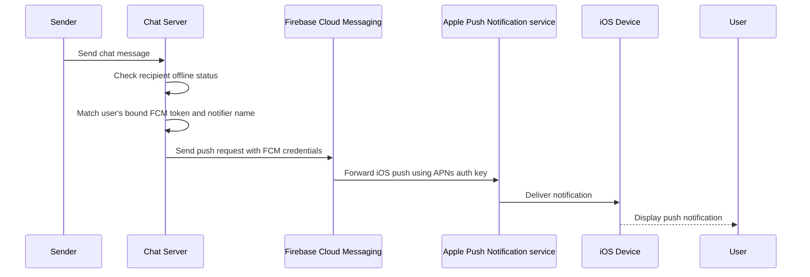

# Integrate Offline Push with Flutter FCM for APNs

## 1. Overview

When Flutter offline push is implemented through FCM for APNs, the full chain involves the following roles:

- **Chat Server**: Stores user-device push bindings and triggers offline push when the message recipient is offline.
- **Firebase Cloud Messaging (FCM)**: Receives push requests from Chat Server and forwards iOS push notification to APNs.
- **Apple Push Notification service (APNs)**: Delivers the final push notification to the target iOS device.

For iOS devices, FCM does not directly replace APNs. Instead:

- The app registers for Apple push capability on iOS.
- Firebase uses the APNs authentication key uploaded in Firebase Console to communicate with APNs.
- Chat Server uses the FCM credentials uploaded in Agora Console to communicate with Firebase.

## 2. Prerequisites

Before proceeding, make sure:

- The Chat SDK has already been initialized. For details, see the [SDK quickstart](https://docs.agora.io/en/agora-chat/get-started/get-started-sdk).
- You understand the API frequency limits described in [Limitations](https://docs.agora.io/en/agora-chat/develop/reference/limitations).
- The Flutter project can already run on Android and iOS.
- For iOS testing, use a real device whenever possible.

## 3. End-to-End Architecture

### 3.1 Certificate upload relationship

The following diagram shows how credentials are prepared and uploaded across Apple, Firebase, and Chat:



### 3.2 Push delivery flow

The following diagram shows the actual offline push path for an iOS device:



## 4. Preparation in Firebase

### 4.1 Create a Firebase project

1. Log in to the [Firebase console](https://console.firebase.google.com/).
2. Create a Firebase project.
   If Google Analytics is not needed, you can disable it during setup.
3. After the project is created, [add your Flutter app in the Firebase project](https://firebase.google.com/docs/android/setup#register-app).

### 4.2 Download `google-services.json`

For Android integration:

1. Open the **Project settings** page in Firebase console.
2. In **Your apps**, locate the Android app.
3. Download `google-services.json`.
4. Put the file into the Android app module root directory.


### 4.3 Get the FCM Sender ID

1. In **Project settings** of Firebase Console, open the **Cloud Messaging** tab.
2. Find the **Sender ID**.
3. When uploading the FCM certificate to Agora console, use this Sender ID as the **Certificate Name**.

This value is important because Chat Server uses it to determine which push channel should be used for the target device.


### 4.4 Generate the FCM V1 private key

1. In Firebase console, open **Project settings** > **Service accounts**.
2. Click **Generate new private key**.
3. Download the generated JSON file.
4. Use this file when uploading the FCM V1 certificate to Agora console.


### 4.5 Upload the APNs authentication key to Firebase

This step is required only when you **use FCM to push notifications to iOS through APNs**.

1. In Apple Developer, create an APNs authentication key (`.p8`).
2. Upload the APNs key to Firebase console. See the [Firebase guide](https://firebase.google.com/docs/cloud-messaging/flutter/get-started?hl=en#upload-authentication-key)
3. Associate it with your iOS app configuration in Firebase.

After this step, Firebase can forward iOS push requests to APNs on behalf of your application.

## 5. Upload the FCM Certificate to Agora Console

After the Firebase project is ready, upload the FCM credentials to Agora console so that Chat Server can call Firebase.

### 5.1 Upload path

1. Log in to [Agora Console](https://console.agora.io/v2).
2. In the left navigation bar, choose **Project Management**.
3. Find the project with Chat enabled and click **Config**.
4. In the Chat section, click **Config**.
5. Open **Features** > **Push Certificate**.
6. Click **Add Push Certificate**.
7. In the pop-up window, choose the **Google** tab.


### 5.2 Recommended configuration

Use **V1** certificate type whenever possible.

| Parameter            | Type   | Required | Description                                                  |
   | -------------------- | ------ | -------- | ------------------------------------------------------------ |
   | **Certificate Type** |        | No       | Select whether to use a V1 certificate or a legacy certificate.**V1**: Recommended. You need to configure a **Private Key**.**Legacy**: Will soon be deprecated. You need to configure a **Push Key**. |
   | **Private Key**      | file   | Yes      | Click **Generate new private key** on the **Project settings** > **Service accounts** page of the [Firebase Console](https://console.firebase.google.com/) to generate the `.json` file, then upload it to Agora Console. |
   | **Push Key**         | String | Yes      | FCM Server Key. Obtain the server key in the **Cloud Messaging API (Legacy)** area of the **Project settings** > **Cloud Messaging** page of the [Firebase Console](https://console.firebase.google.com/).  **This parameter is only valid for legacy certificates.** |
   | **Certificate Name** | String | Yes      | The sender ID configured for the FCM. For the new version of the certificate, you can find the sender ID on the **Project settings** > **Cloud Messaging** page of the [Firebase Console](https://console.firebase.google.com/).For legacy certificates, go to the ***Project settings > Cloud Messaging** page of the [Firebase Console](https://console.firebase.google.com/), and get the sender ID in the **Cloud Messaging API (Legacy)** area. The certificate name is the only condition used by the Agora server to determine which push channel the target device uses, so ensure that the sender set when integrating FCM in Chat is consistent with what is set here. |
   | **Sound**            | String | No       | The ringtone flag for when the receiver gets the push notification. |
   | **Push Priority**    |        | No       | Message delivery priority. See [Setting the priority of a message](https://firebase.google.cn/docs/cloud-messaging/concept-options#setting-the-priority-of-a-message). |
   | **Push Msg Type**    |        | No       | The type of the message sent to the client through FCM. See [Message types](https://firebase.google.com/docs/cloud-messaging/concept-options#notifications_and_data_messages):**Data**: Data message, processed by the client application.**Notification**: Notification message, automatically processed by FCM SDK.**Both**: Notification messages and data messages can be sent through the FCM client. |

### 5.3 Switch from legacy to the V1 certificate

The legacy HTTP or XMPP API is being retired on June 20, 2024. In view of this, switch to the latest FCM API (HTTP v1) version of the certificate as soon as possible. See [Firebase Console](https://console.firebase.google.com/) for details.

Make sure that the uploaded V1 certificate is available, as the legacy one will be deleted upon upload. If the new certificate is not available, the push will fail.

Take the following steps to switch from the old to the new certificate:

1. Click **Edit** in the **Action** column of the old certificate on the **Push Certificate** page.

   

2. In the **Google** tab of the **Edit Push Certificate** window, switch the **Certificate Type** to **V1**.

   

3. Click **Upload** to upload the locally saved V1 certificate file (.json).

   

4. Click **OK** to complete the switch.

Note:

- Confirm the new V1 certificate is valid before replacing the old one.
- If the uploaded V1 certificate is invalid, push delivery will fail after the legacy certificate is removed.

## 6. Integrate FCM on the client

### 6.1 Install dependencies

In the Flutter project root directory, install:

```bash
flutter pub add firebase_core
flutter pub add firebase_messaging
```

### 6.2 Android setup

Check the `google-services` plugin version in `Android/build.gradle` and make sure it is `4.3.14` or later:

```gradle
dependencies {
    classpath 'com.google.gms:google-services:4.3.15'
}
```

### 6.3 iOS setup

Before receiving push messages on iOS:

1. Open the Xcode project workspace (`ios/Runner.xcworkspace`).
2. [Enable push notifications](https://help.apple.com/xcode/mac/current/#/devdfd3d04a1).
3. Enable background fetching and remote notifications [background execution modes](https://developer.apple.com/documentation/xcode/configuring-background-execution-modes).

### 6.4 Initialize Chat SDK and Firebase

Initialize the Chat SDK and enable FCM:

   ```dart
   void main() async {
  WidgetsFlutterBinding.ensureInitialized();
  // Replace with your Appkey.
  var options = ChatOptions(appKey: "Your Appkey", autoLogin: false);
  // Replace with your FCM Sender ID.
  options.enableFCM("Your FCM sender id");
  // Initialize the IM SDK.
  await ChatClient.getInstance.init(options);
  // Initialize FCM SDK.
  await Firebase.initializeApp(
    options: DefaultFirebaseOptions.currentPlatform,
  );
  runApp(const MyApp());
}
```

### 6.5 Upload the FCM token to Chat Server

This step is mandatory. FCM can only deliver notifications after the app uploads the device token to Chat Server.

Token binding logic:

1. Firebase SDK generates the device registration token.
2. The app uploads the token through `updateFCMPushToken`.
3. Chat Server stores the token and associates it with the current user/device.
4. When the user goes offline, Chat Server uses that token for FCM push delivery.

```dart
   // Request push permission
   await FirebaseMessaging.instance.requestPermission();
   FirebaseMessaging.instance.onTokenRefresh.listen((event) async {
       debugPrint('onTokenRefresh: $event');
       await ChatClient.getInstance.pushManager.updateFCMPushToken(event);
   });
   // Get the token and upload it to instant communication.
   final fcmToken = await FirebaseMessaging.instance.getToken();
   if (fcmToken != null) {
     debugPrint('fcmToken: $fcmToken');
     await ChatClient.getInstance.pushManager.updateFCMPushToken(fcmToken);
   } else {
      debugPrint('fcmToken is null');
   }
   ```

## 7. Test FCM push

Before testing, confirm all three platform configurations are complete:

### 7.1 Apple side

- APNs capability is enabled for the iOS app.
- APNs authentication key (`.p8`) is created in Apple Developer.
- The APNs key has been uploaded to Firebase.

### 7.2 Firebase side

- Firebase project is created.
- `google-services.json` is downloaded for Android.
- Sender ID is obtained.
- Service account JSON is generated.
- Firebase Messaging is integrated in the Flutter app.

### 7.3 Chat / Agora side

- FCM V1 certificate is uploaded in Agora Console.
- Certificate Name equals the Firebase Sender ID.
- The client successfully uploads the FCM token to Chat Server.

After integrating and enabling FCM, you can test whether the push feature is successfully integrated.

Make sure your test device meets the following conditions:

- Uses foreign IP addresses to establish connections.
- Supports Google GMS services (Google Mobile Services).
- Can access Google network services; otherwise, the device won't be able to receive push notifications from the FCM service.

For more reliable testing, use a physical device.

## 8. Test push notifications

1. Log in to the app on your device and confirm that the device token is successfully bound.

   You can check the log or call [RESTful API for getting user details](https://docs.agora.io/en/agora-chat/restful-api/user-system-registration#querying-a-user) to confirm whether the device token is successfully bound. If successful, there will be a `pushInfo` field under the `entities` field, and `pushInfo` will have relevant information such as `device_Id`, `device_token`, `notifier_name`, and others.

2. Enable app notification bar permissions.

3. Kill the application process.

4. Send a test message in the [Agora Console](https://console.agora.io/v2).

   Select **Operation Management** > **User** in the left navigation bar. On the **Users** page, select **Send Admin Message** in the **Action** column for the corresponding user ID. In the dialog box that pops up, select the message type, enter the message content, and then click **Send** .

   Note

   In the **Push Certificate** page, in the **Action** column of each certificate, click **More** and **Test** will appear. This is to directly call the third-party interface to push. The message sending test in the **Users** page first calls the Chat message sending interface and then the third-party interface when the conditions are met (that is, the user is offline, the push certificate is valid and bound to the device token).

5. Check your device to see if it has received the push notification.

## 9. Troubleshooting

In case of issues, take the following steps:

1. Check whether FCM push is correctly integrated or enabled:

   Select **Operation Management** > **User** in the left navigation bar. On the **User Management** page, select **Push Certificate** in the **Action** column for the corresponding user ID. In the pop-up box, check whether the certificate name and device token are displayed correctly.

2. Check whether the correct FCM certificate is uploaded in the [Agora Console](https://console.agora.io/v2).

3. Check whether the message is pushed in the chat room. The chat room does not support offline message push.

4. Check if the device supports GMS.

5. Check whether online-only delivery is enabled (`deliverOnlineOnly` = `true`). Messages set to be delivered only when the receiver is online will not be pushed.
