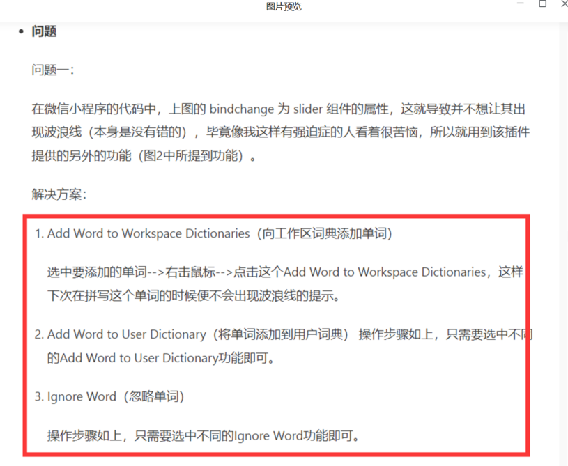
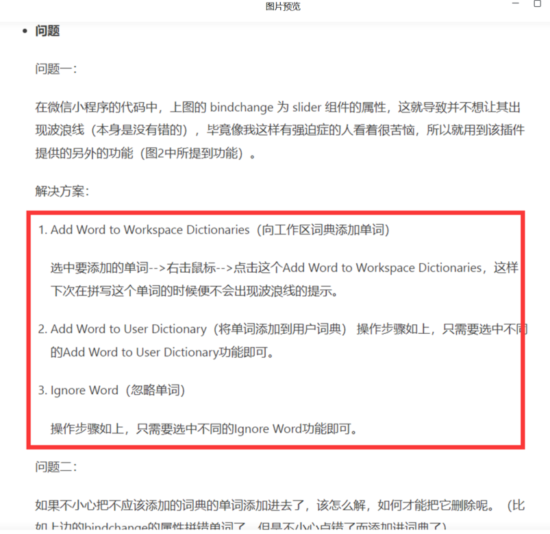
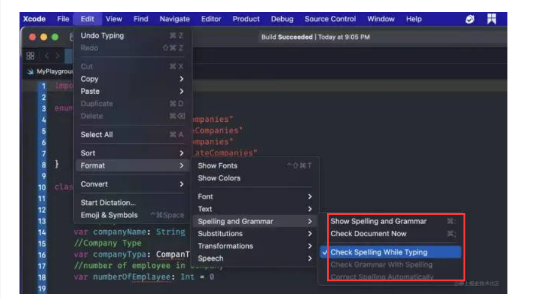
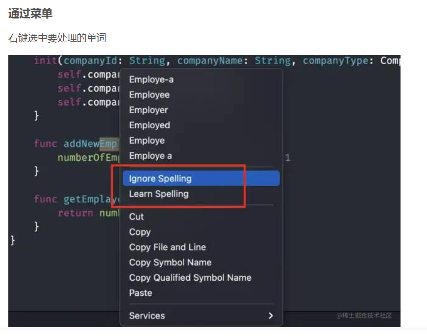

# VSCode/Xcode 中的拼写检查

## VSCode 拼写检查

关于 VSCode 中的拼写检查，你可以参考[相关文档](https://www.jianshu.com/p/d82cefcdc89d)。

1.	安装拼写检查插件： Code Spell Checker 

    拼写错误的单词下面是有波浪线。

2.	一些特殊词汇如 Easemob，AgoraChat 等无需检查，请在词典中添加词汇，检查会略过。
 

 
## Xcode 拼写检查

设置 Xcode 中的拼写检查，你可以参考[相关文档](https://blog.csdn.net/olsQ93038o99S/article/details/121846857) 。

1.	在该工具中设置代码拼写检查，图中红框中的几项均开启。

 
2.	一些特殊词汇如 Easemob，AgoraChat 等无需检查，请在词典中添加词汇，检查会略过。

 
