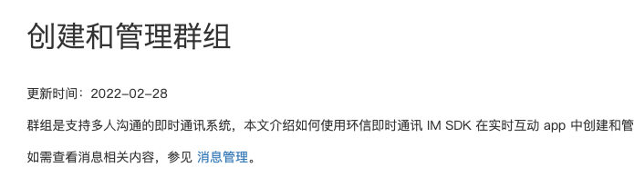
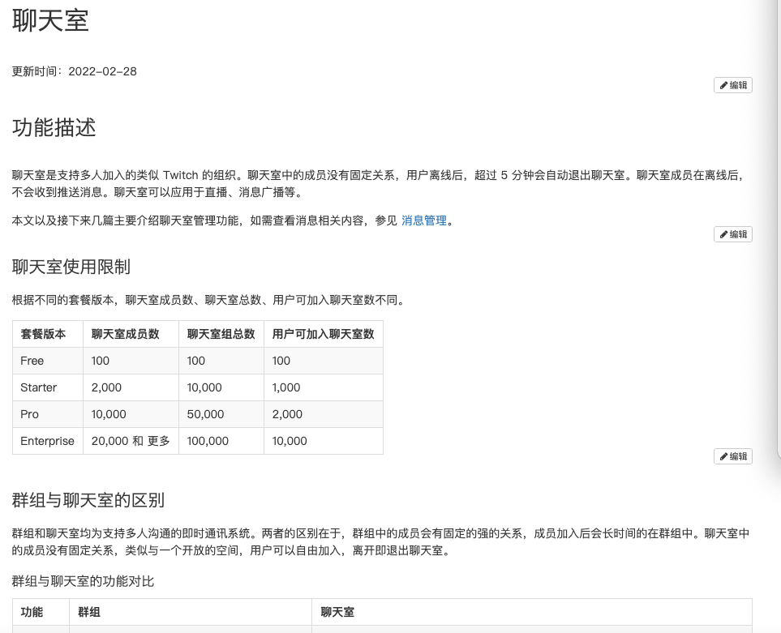
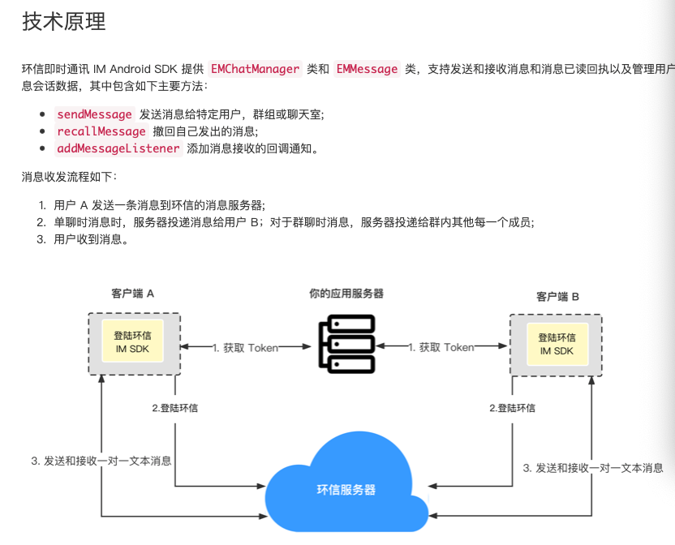
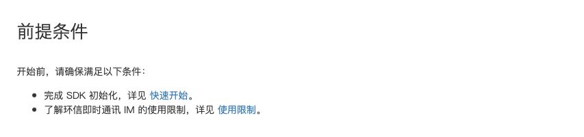
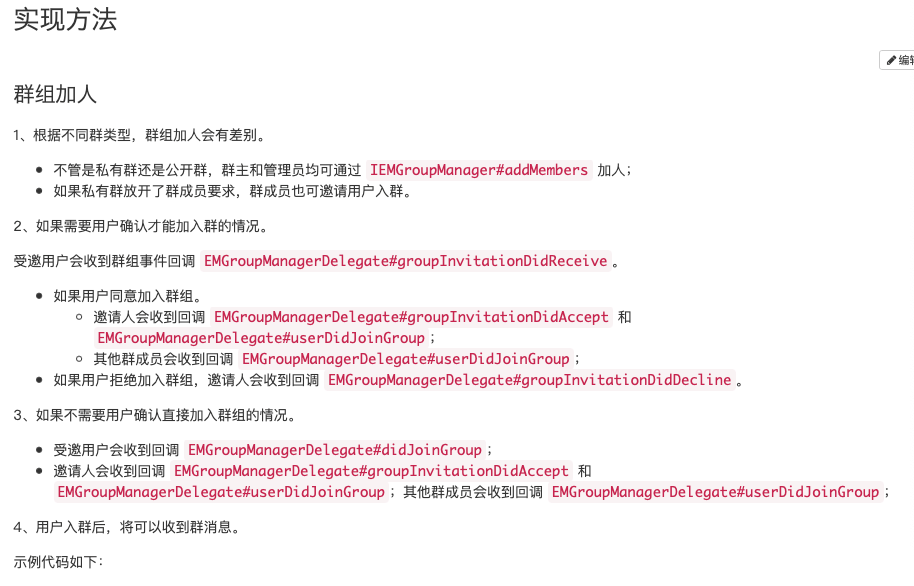
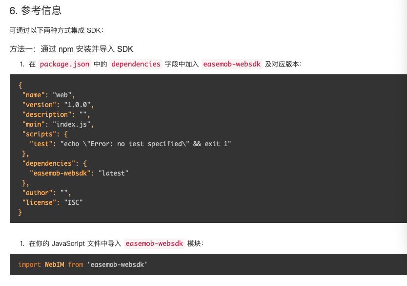

# 功能集成概述类文档规范

本文档介绍功能集成概述文档结构及基本规范。特性集成文档须包含以下内容：

1. 特性描述（包括应用场景）
2. 支持版本、是否需开通（注明联系商务或在环信控制台开通）
3. 如何实现：实现流程、回调、多设备事件
4. 注意事项：限制、与其他功能之间的关联

## 一级标题

一般为动宾短语。例如 “创建和管理群组”。

 

## 二级标题-功能概述

功能概述及场景描述：简明地描述产品的主要功能，最好可以提供产品架构图。如下图所示：
 

## 二级标题-技术原理

概括介绍实现功能的技术架构及工作流程。根据情况提供架构图、工作流程图、动图、屏幕截图等，然后用简洁的文字描述实现功能的完整流程。如下图所示：

 

## 二级标题-前提条件

列出实现功能或特性需要满足的条件，比如开发环境要求等。尽量简短，且确保包含读者必须了解的概念。前提条件中不可以包含步骤类描述，如果有必要可以提供链接到其他的文档或者在实现部分描述步骤。如下图所示：

    
## 二级标题-实现方法

核心 API，API 调用时序，真实示例代码，最好有 Demo，开发注意事项；
- 实现本文功能的具体步骤，步骤的小标题可以根据实际情况改写。 
- 如果实现流程中有多个部分的代码逻辑，比如前端和后端实现，用子章节分开描述。

## 二级标题-参考信息

提供 Git Hub 示例项目的链接，相关文档的链接等参考信息。本标题为可选，非必须项。

