# 环信 API Reference 写作规范

本文为环信各客户端的 API Reference 写作规范。

## API 的注释范围

以下内容必须提供注释：

- 所有的类、接口、结构体等 API 成员。
- 所有的常量、枚举值、字段、typedef。
- 所有的方法，包括方法的参数、返回值、可能抛出的异常等。
- 注意：提到 API 名、类、方法、常量等时均使用代码符格式，并且提供相应链接。

本文中的举例为 Android 版 API Reference进行描述。

## API 注释内容

本章介绍 API 注释的各组成部分以及回调函数的描述。

### API 注释介绍

|项目|描述|
| :- | :- |
|[API 概述](#api-概述)|能明确表达该API 功能或作用的短语或句子。|
|[API 的前提及相关信息](#api-的前提及相关信息)|明确该 API 的使用前提，例如，调用权限以及该 API 是同步还是异步方法，提供同步或异步方法链接，以及使用在何种场景，与其他 API 的关系等等。|
|[API 的注意事项](#api-的注意事项)|使用该 API 时需注意的事项。|
|[API 的参数描述](#api-的参数描述)|API 中的参数描述。|
|[API 的返回值](#api-的返回值)|明确 API 执行后的返回值。|
|[API 的回调](#api-的回调)|明确 API 执行触发的回调。|
|[API 的异常和错误码](#api-的回调)|明确 API 执行过程中可能出现的异常或错误，提供错误码。|
|[API 的废弃](#api-的废弃)|明确该 API 是否已废弃，被其他API替代。|
|[各平台示例代码块](#各平台示例代码块)|明确 Android、iOS 和 Web的示例代码块。|
|[回调函数](#api-的回调)|描述触发回调的条件和回调提供的信息。|

### API 概述

介绍该 API 功能或作用的短语或句子。

以下为 EMGroupManager.java 文件中的 EMGroupManager 类的描述：

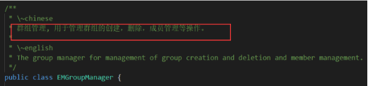

以下为 EMChatRoomManager.java 文件中的 EMChatRoomManager 类的描述：

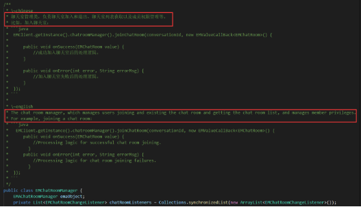

### API 的前提及相关信息

描述 API 的使用前提及使用场景等信息，例如，明确该方法的调用权限：所有群组/聊天室成员均可调用，或者仅群组/聊天室所有者和管理员可调用此方法。

例如，EMChatRoom.java 中的 getBlacklist() 方法：

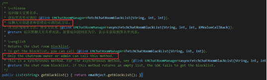

例如，明确API是同步还是异步方法，提供同步或异步方法链接。

EMChatRoom.java 中的 getBlacklist() 方法：

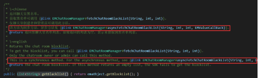

### API 的注意事项

需明确利用该方法时有哪些注意事项，例如，该 API 执行后会对用户有哪些影响。若有多个注意事项，需以列表方式列明。

例如，EMChatRoom.java 中的 blockChatroomMembers() 方法：

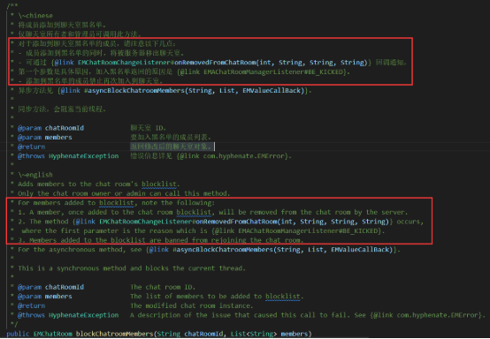

注意事项的格式

Web、Android 和鸿蒙：@note，前后不需要添加空行

下图为编辑形式：

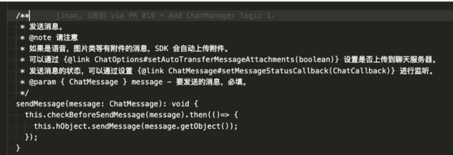

下图为展示效果：

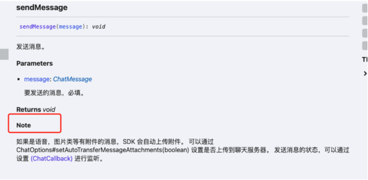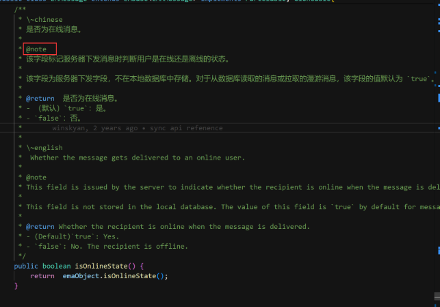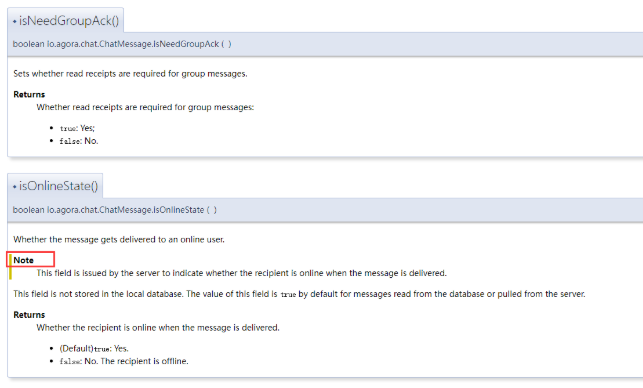


### API 的参数描述

#### 参数描述

一般情况下，API中的参数描述包含以下几项：

1. 参数的解释。
2. 是否必填/选填。
3. 参数值：取值范围、可取的值/不可取的值，默认值以及默认值的含义。

   注意：如果参数的取值范围是几个确定的值，用无序列表分别描述每个值。

4. 参数值支持的字符类型、大小、长度限制或单位。

 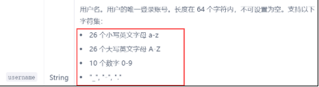

5. 如果参数是 Bool 值，请提供 true/false 两个选项的描述

布尔型的参数描述使用列表分别表示 true 和 false，布尔值的写法和大小写按照代码实际值来写，使用代码格式。如果该参数为执行某个操作，布尔值的描述直接用动词开头，英文使用祈使句（而不是第三人称单数）。如果该参数为描述状态，布尔值的描述对应的状态。

例如：`true`: 麦克风已启用。

`false`: 麦克风已禁用。

 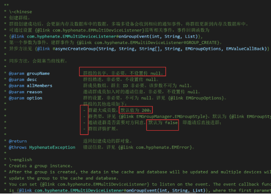

#### 分页的表达

1. pageNum + pageSize

   pageNum：每页显示的记录数（具体为聊天室数量、群组数量、群组成员数量等，视具体情况而定）。

   pageSize：当前页码，从 1 开始。

   例如 groumanager.java 中的例子：

    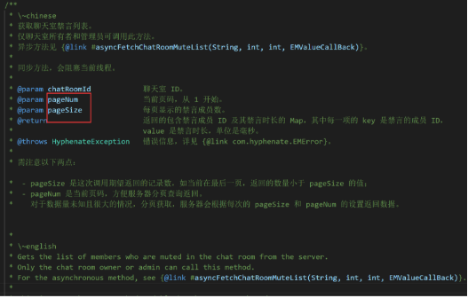

2. pageSize + cursor

   pageSize：每页显示的记录数（具体为聊天室数量、群组数量、群组成员数量等，视具体情况而定）。

   cursor：从该游标位置开始获取数据，首次获取数据时传 null 即可。
   
   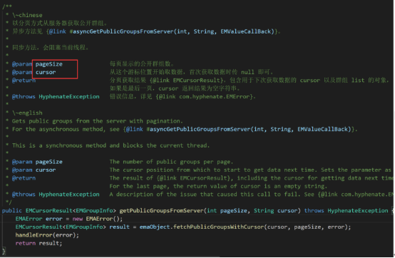


### API 的返回值

返回值的描述尽量简洁，返回的实际值均使用代码格式。

- 如果有具体的错误码，需要给出枚举值链接，如有特定描述需给出。
- 如果返回值为 0 和整型负数，使用列表表示：
- 0：方法调用成功。
- < 0：方法调用失败。
- 0: Success.
- < 0: Failure.
- 如果返回值是布尔型，使用列表分别表示 true 和 false。
- 仅适用于英文注释：如果返回值为其他类型，则使用 “The ...”。例如 The connection state.

 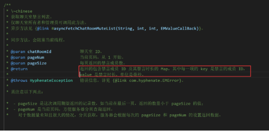

### API 的回调

若方法执行后触发回调，需明确具体回调函数以及返回信息。

例如，EMChatRoomManager.java 中的 void joinChatRoom 方法的回调：

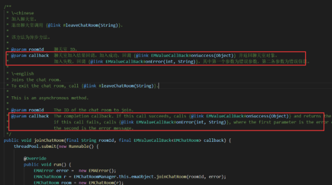

### API 的异常和错误码

目前，错误码并未一一列明，以链接形式说明。

例如 EMChatRoomManager.java中的 fetchPublicChatRoomsFromServer()方法。

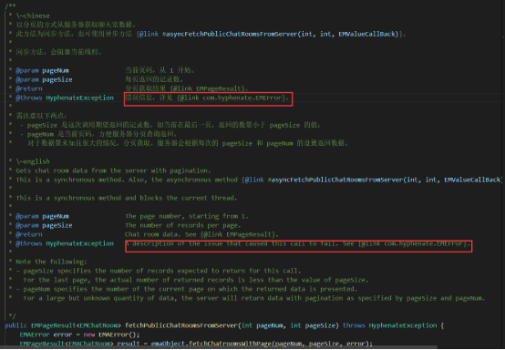

### API 的废弃

若该接口已废弃，需注明，描述格式为：

已废弃，请用 [ ] 代替。

Deprecated. Please use [ ] instead.

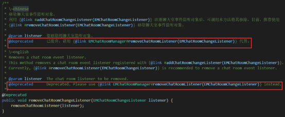

### 示例代码块

**Android示例代码块：**

将 `<pre>` `</pre>`分别替换为 “```java” 和 “````”，如下所示：

```java
 *     // ConversationId can be the other party id, the group id, or the chat room id
 *     EMConversation conversation = EMClient.getInstance().chatManager().getConversation(conversationId);
 *     int unread = conversation.getUnreadMsgCount();
 * 
```


**Web示例代码块：**

用 “```typescript” 和  “```” 将代码括起来，如下所示：

```typescript
 * connection.unmuteChatRoomMember({chatRoomId: 'chatRoomId', username: 'user1'})
```


**iOS示例代码块：**

用 “```objectivec” 和 “```” 将代码括起来，如下所示：

```objective-c

[[AgoraChatClient sharedClient].groupManager destroyGroup:@"groupID"];

```

**私有方法**

API reference 中的 Private method 的注释需要用 /// @cond 和 /// @endcond 括起来

```
/// @cond
	// Private method.
    /**
     *  Creates a group.
     *
     *  @param style                The public or private group.
     *  @param groupName            The group name.
     *  @param desc                 The group description.
     *  @param allMembers           The group members, excluding the owner and creator.
     *  @param maxUsers             The maximum group member capacity.
     *  @param reason               The invitation message.
     *  @param inviteNeedConfirm    Whether to need invitation confirmation.
     *  @param extension            The group extension information.
     *  @return                     The created group.
     */
	 /// @endcond
    private EMGroup createGroup(int style,
                                String groupName,
                                String desc,
                                String[] allMembers,
                                int maxUsers,
                                String reason,
                                boolean inviteNeedConfirm,
                                String extension) throws HyphenateException {
        EMAGroupSetting setting = new EMAGroupSetting(style, maxUsers, inviteNeedConfirm, extension);
        List<String> newMembers = new ArrayList<String>();
        Collections.addAll(newMembers, allMembers);
        EMAError error = new EMAError();
        EMAGroup group = emaObject.createGroup(groupName, desc, reason, setting, newMembers, inviteNeedConfirm, error);
        handleError(error);
        return new EMGroup(group);
}
```

### 回调函数

描述触发回调的条件和回调提供的信息。

仅适用于中文注释：第一行描述为 xxx 回调。

仅适用于英文注释："Occurs when ……" or "Reports ……"。

例如，EMContactListener.java中的onContactAdded(String username) 回调函数。

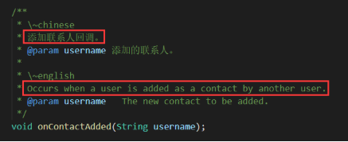

## API Reference 中的常见句式

|编号|中文|英文|
| :- | :- | :- |
|1|已废弃，请用 [ ] 代替。|Deprecated. Please use [ ] instead.|
|2|同步方法，会阻塞当前线程。|This is a synchronous method and blocks the current thread.|
|3|异步方法。|This is an asynchronous method.|
|4|` `@param aCompletionBlock 该方法完成调用的回调。如果该方法调用失败，会包含调用失败的原因。|@param aCompletionBlock The completion block, which contains the error message if the method fails.|
|5|仅聊天室创建者和管理员可调用此方法。|Only the chatroom owner or administrator can call this method.|
||@param  reason   拒绝理由。|@param reason The reason for declining.|
|6|错误信息，详见 {@link EMError}。|A description of the issue that caused this call to fail. See {@link EMError}.|
|7|异步方法见{@link #asyncGetPublicGroupsFromServer(int, String, EMValueCallBack)}。|For the asynchronous method, see {@link #asyncGetPublicGroupsFromServer(int, String, EMValueCallBack)}.|
|8|@param pageSize	 每页返回的公开群组数。|@param pageSize The number of public groups per page.|
|9|@param cursor从这个游标位置开始取数据，首次获取数据时传 null 即可。|@param cursor The cursor position from which to start to get data next time. Sets the parameter as null for the first time.|
|10|@param pageNum 当前页码，从 1 开始。|@param pageNum The page number, starting from 1.|
|11|以分页方式从服务器获取公开群组。|Gets public groups from the server with pagination.|
|12|获取聊天室详情。|Gets specifications of the chat room.|
|13|撤回消息|Recalls a message.|
|14|取消成员的管理员权限回调。|Occurs when a member's admin privileges are removed.|

