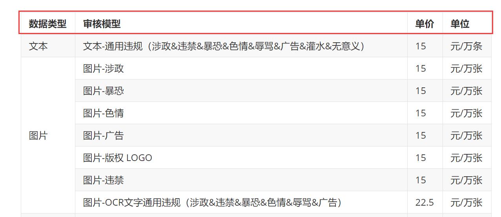
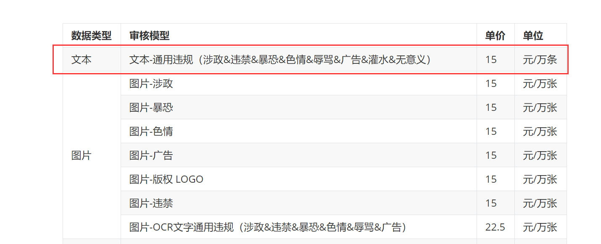
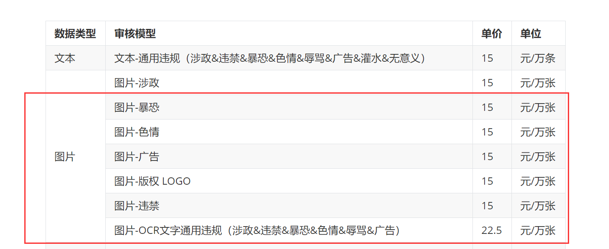

# HTML 表格编辑 Markdown 文件中的行合并

## 表格标记

<table> </table> 整个表格的标记
   
## 表头
   
表头这一行用 <tr> </tr>标记，这一行的每一列用 <th></th>标记。

编码示例：

<tr>
    <th>数据类型</th>
    <th>审核模型</th>
    <th>单价</th>
    <th>单位</th>
</tr>

以上代码显示示例：

 
## 普通一行代码
   
这一行用<tr> </tr>标记，行中的每一列用<td> </td>表示。

<tr>
    <td>文本</td>
    <td>文本-通用违规（涉政&违禁&暴恐&色情&辱骂&广告&灌水&无意义）</td>
    <td>15</td>
    <td>元/万条</td> 
</tr>

## 多行合并为一行
   
a. 一整行用<tr> </tr>标记，行中被分成的子行用<tr> 开头。

b. 子行中的列用<td> </td>表示。

c. 首个子航放在<td rowspan="XX">XXX</td>下面，无需单独添加<td>，其他子行均以 <tr>开头。

d. 一整行结束时添加  </tr>，最后一个子行结束时添加  </tr>。也就是说，一整行结束时需要添加两个 </tr>。除最后一个子行，其他子行结束时，无需添加 </tr>。

<tr>
    <td rowspan="7">图片</td>
    <td>图片-涉政</td>
    <td>15</td>
    <td>元/万张</td>
  <tr>
    <td>图片-暴恐</td>
    <td>15</td>
    <td>元/万张</td>
  <tr>
    <td>图片-色情</td>
    <td>15</td>
    <td>元/万张</td>
  <tr>
    <td>图片-广告</td>
    <td>15</td>
    <td>元/万张</td>
  <tr>
    <td>图片-版权 LOGO</td>
    <td>15</td>
    <td>元/万张</td>
  <tr>
    <td>图片-违禁</td>
    <td>15</td>
    <td>元/万张</td>
  <tr>
    <td>图片-OCR文字通用违规（涉政&违禁&暴恐&色情&辱骂&广告）</td>
    <td>22.5</td>
    <td>元/万张</td>
  </tr>
  </tr>

以上代码显示示例：

 
